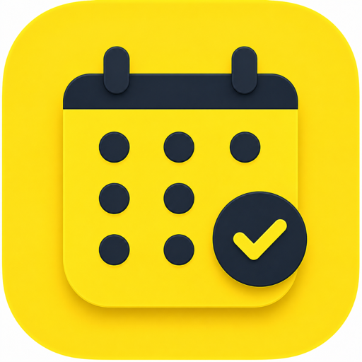

  

  # Dueline

  ### Never miss a bill again.

  **Dueline keeps every bill, paycheck, and account balance in one calm place —
  with reminders before anything is due. All on your iPhone, all private.**

  [**🌐 Visit the website**](tempURL) &nbsp;·&nbsp; [**📲 Download on the App Store**](#-download) &nbsp;·&nbsp; [**🔒 Privacy**](tempURL/privacy)

---

## Overview

**Dueline** is a native iOS app that brings every bill, paycheck, and account
balance into one clear overview. Track due dates, get reminded before anything's
due, and always know exactly what you owe, earn, and hold.

It's built to be **privacy-first**: no sign-up, no ads, no analytics, no
third-party tracking. Your data stays on your iPhone — and, if you choose, syncs
only through your own private iCloud.

> *Get everything you owe and earn organized in minutes.*

---

## ✨ Features

### 💳 Track every bill
Add bills with amounts, categories, due dates, and notes. Set them to **repeat
automatically** — weekly, biweekly, twice a month, monthly, quarterly, every 6
months, or yearly — and mark them paid with a tap.

### 🔔 Never miss a due date
Get a local reminder on the day a bill is due, plus an **optional early
reminder** 1–5 days ahead. Every reminder is scheduled right on your device.

### 💵 Log your income
Track paychecks and other income — one-off or recurring — and see how what you
earn lines up against what you owe.

### 🏦 Know your balances
Track multiple accounts (checking, savings, credit card, cash, and more) with
**live balances** that update automatically as bills and income are recorded.

### 📅 See it on a calendar
A clean month view marks every bill and payday. Tap any day to see exactly
what's scheduled.

### 📊 Understand your spending
Beautiful charts break down spending by category and reveal your monthly trends
at a glance.

### ☁️ Private iCloud sync
Your data syncs securely through **your own private iCloud** and restores on a
new device or after reinstalling. No iCloud? Dueline works fully offline.

### 🔒 Truly private
No accounts. No ads. No analytics. No tracking SDKs. Nothing is ever sent to the
developer or any third party.

---

## 🔗 Live website

The Dueline marketing site is deployed on **Vercel**:

**👉 tempURL**

---

## 📲 Download

**Coming soon to the App Store.**

<!-- Replace # with the App Store URL once the app is live -->
[**Download on the App Store →**](#)

---

## Privacy

Dueline does not collect, sell, share, or transmit personal data to the
developer or any third party. There are no analytics, ads, tracking SDKs, or user
accounts. Read the full policy in [**🔒 Privacy**](tempURL/privacy).

**Requires iOS 18.0 or later · iPhone**

© 2026 Fenil Shah. All rights reserved.

